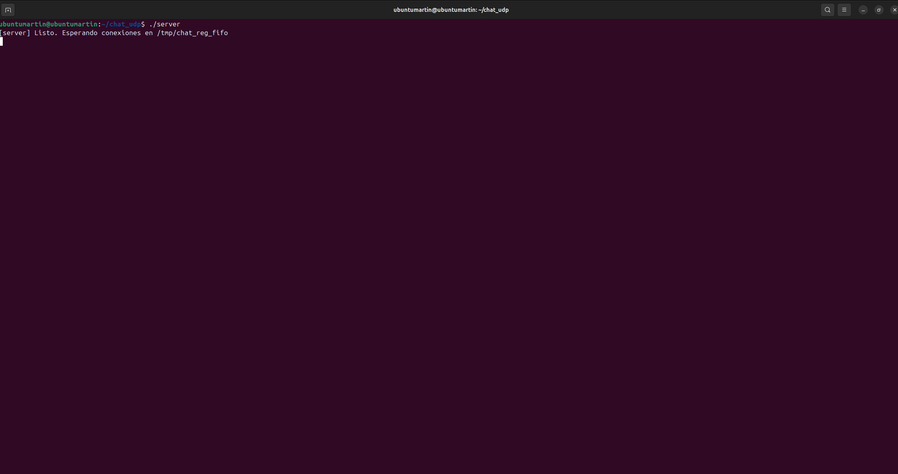

# Chat por Pipes (C++/UNIX)

Este proyecto está orientado a que cualquier persona pueda entender de manera sencilla qué es el chat basado en pipes, cómo instalarlo en un entorno Linux, de qué forma ejecutarlo y cuáles son los pasos necesarios para utilizarlo desde la terminal.

El desarrollo se centra en la experiencia práctica: se detalla el proceso de compilación, el inicio del servidor, la conexión de múltiples clientes y la puesta en marcha de las funciones principales del chat, como el envío y recepción de mensajes, la duplicación de procesos y la gestión de reportes. La explicación evita entrar en detalles de programación más allá de lo imprescindible, lo que permite enfocarse directamente en el uso del sistema.

Al final se incluyen los archivos completos (server.cpp, client.cpp, common.hpp y Makefile), lo que hace posible copiarlos, compilarlos y ejecutar los binarios generados de forma inmediata, sin configuraciones adicionales ni necesidad de conocimientos avanzados de C++. 

## Tabla de contenido

- [Información general](#información-general)
- [Tecnologías utilizadas](#tecnologías-utilizadas)
- [Características](#características)
- [Configuración](#configuración)
- [Pruebas realizadas](#pruebas-realizadas)
- [Resultados](#resultados)
- [Códigos](#códigos)
- [Contacto](#contacto)

---

## Información general

El sistema implementa un chat multi-proceso en terminal, que funciona exclusivamente con pipes (FIFOs) en UNIX. 

Está conformado por tres componentes principales:
- Un servidor central, encargado de aceptar conexiones, difundir mensajes y coordinar un proceso auxiliar (reporter) que gestiona los reportes.
- Varios clientes independientes, capaces de enviar y recibir mensajes, duplicarse mediante el comando /dup y reportar a otros procesos utilizando /report o reportar.
- Un proceso de reportes (reporter), responsable de contabilizar las denuncias acumuladas por cada cliente y expulsar automáticamente a quienes superen las 10 advertencias, enviándoles la señal SIGKILL.
---

## Tecnologías utilizadas

- **Ubuntu 20.04+** o **WSL (Ubuntu)** en Windows  
- **g++ (GNU C++17)**  
- **make**  
- **FIFOs POSIX** y `poll()`

---

##  Características

- Comunicación **FIFO bidireccional** (2 pipes por cliente).  
- **Difusión** de mensajes a todos los clientes con formato `[pid] mensaje`.  
- **Duplicación de clientes** (`/dup`).  
- **Reportes y expulsión** automática (`reportar <pid>` o `/report <pid>`).  
- **Sin hilos**, solo procesos + pipes.  
- Manejo de señales y limpieza de FIFOs al salir.
---


## Configuración

### 1) Instalar herramientas de compilación

```bash
sudo apt update
sudo apt install -y build-essential
g++ --version
make --version

```
### 2) Crear la carpeta del proyector
```bash
mkdir -p ~/chat_udp
cd ~/chat_udp
```
### 3) Crear los archivos del proyecto
```bash
nano common.hpp
nano server.cpp
nano client.cpp
nano Makefile
```
Todos los códigos de este proyecto se pueden encontrar al final en [Códigos](#códigos).


### 4) Compilar
```bash
make clean && make
```
Se crearán los binarios:
- server
- client

### 5) Ejecutar
- Terminal A (Servidor):
```bash
./server
```
- Terminal B (Cliente 1):
```bash
./client
```
- Terminal C (Cliente 2):
```bash
./client
```
### 6) Comandos en cliente
```bash
/help
/dup
/report <pid>   (o)  reportar <pid>
/exit
```
### 7) Cierre y limpieza
- Clientes: /exit
- Servidor: Ctrl+C
- Limpiar FIFOs huérfanas (solo si quedaron):
  ```bash
  rm -f /tmp/c2s_* /tmp/s2c_* /tmp/chat_reg_fifo
  ```

##  Pruebas Realizadas

- Mensajes básicos → un cliente escribe, todos lo reciben.



- Duplicación → con /dup aparece un nuevo cliente con PID distinto.


- Reportes → al enviar más de 10 reportes contra un PID, el cliente es expulsado.


- Limpieza → clientes y servidor cierran correctamente sus FIFOs.


## Resultados

- El sistema funciona en Linux/WSL sin errores de ENXIO.

- Se logró comunicación estable, duplicación de procesos y expulsión por reportes.

## Códigos

- Common.hpp
```bash
#ifndef COMMON_HPP
#define COMMON_HPP

#include <limits.h>

#define REG_FIFO "/tmp/chat_reg_fifo"
#define MAX_MSG 1024
#define MAX_NAME 256

#define REPORT_PREFIX1 "reportar "
#define REPORT_PREFIX2 "/report "
#define DUP_CMD "/dup"
#define EXIT_CMD "/exit"
#define HELP_CMD "/help"

#endif
```
- Server.cpp
```bash
#include <functional>
#include <iostream>
#include <string>
#include <vector>
#include <cstring>
#include <cstdlib>
#include <cstdio>
#include <csignal>
#include <cerrno>
#include <algorithm>

#include <unistd.h>
#include <sys/types.h>
#include <sys/stat.h>
#include <fcntl.h>
#include <poll.h>
#include <limits.h>

#include "common.hpp"

struct Client {
    pid_t pid{};
    int fd_in{-1};   // cliente -> server
    int fd_out{-1};  // server  -> cliente
    std::string fifo_in;
    std::string fifo_out;
    bool active{false};
};

static std::vector<Client> clients;
static int reg_fd = -1;

// pipes anónimos con el reporter
static int srv2rep[2] = {-1,-1};
static int rep2srv[2] = {-1,-1};
static pid_t reporter_pid = -1;

static void cleanup() {
    if (reg_fd >= 0) close(reg_fd);
    unlink(REG_FIFO);
    if (reporter_pid > 0) {
        kill(reporter_pid, SIGTERM);
    }
}

static void sigint_handler(int) {
    std::cerr << "\n[server] Saliendo...\n";
    cleanup();
    std::_Exit(0);
}

static void trim_newline(char *s) {
    if (!s) return;
    size_t n = std::strlen(s);
    while (n > 0 && (s[n-1] == '\n' || s[n-1] == '\r')) s[--n] = '\0';
}

static bool starts_with(const char* s, const char* pfx) {
    return std::strncmp(s, pfx, std::strlen(pfx)) == 0;
}

static Client* find_client(pid_t pid) {
    for (auto &c : clients) if (c.active && c.pid == pid) return &c;
    return nullptr;
}

static void broadcast(const std::string& line, pid_t from) {
    for (auto &c : clients) {
        if (!c.active) continue;
        dprintf(c.fd_out, "[%d] %s\n", (int)from, line.c_str());
    }
}

static void remove_client(pid_t pid, const char* reason) {
    for (auto it = clients.begin(); it != clients.end(); ++it) {
        if (it->pid == pid) {
            if (it->active) {
                if (reason) dprintf(it->fd_out, "[server] desconexión: %s\n", reason);
                if (it->fd_in >= 0) close(it->fd_in);
                if (it->fd_out >= 0) close(it->fd_out);
                it->active = false;
            }
            clients.erase(it);
            std::cerr << "[server] Cliente " << pid << " removido\n";
            return;
        }
    }
}

static void handle_killed_notice(const std::string& line) {
    // Formato: "KILLED <pid>"
    pid_t pid = 0;
    if (sscanf(line.c_str(), "KILLED %d", &pid) == 1 && pid > 0) {
        std::cerr << "[server] Reporter indica KILLED " << pid << "\n";
        remove_client(pid, "killed por reportes (>10)");
        std::string msg = "El proceso " + std::to_string(pid) + " fue expulsado por reportes.";
        broadcast(msg, 0);
    }
}

static void handle_register(const std::string& line) {
    // "CONNECT <pid> <fifo_in> <fifo_out>"
    char cmd[32], fifo_in[PATH_MAX], fifo_out[PATH_MAX];
    pid_t pid = 0;
    if (sscanf(line.c_str(), "%31s %d %1023s %1023s", cmd, &pid, fifo_in, fifo_out) == 4) {
        if (std::strcmp(cmd, "CONNECT") == 0 && pid > 0) {
            int fd_in = open(fifo_in, O_RDONLY | O_NONBLOCK);
            int fd_out = open(fifo_out, O_WRONLY | O_NONBLOCK);
            if (fd_in < 0 || fd_out < 0) {
                std::cerr << "[server] Error abriendo FIFOs de " << pid << ": " << std::strerror(errno) << "\n";
                if (fd_in >= 0) close(fd_in);
                if (fd_out >= 0) close(fd_out);
                return;
            }
            Client c;
            c.pid = pid;
            c.fd_in = fd_in;
            c.fd_out = fd_out;
            c.fifo_in = fifo_in;
            c.fifo_out = fifo_out;
            c.active = true;
            clients.emplace_back(std::move(c));

            std::cerr << "[server] Cliente conectado: " << pid << "\n";
            dprintf(fd_out, "[server] Bienvenido %d! Usa /help para comandos.\n", (int)pid);
            broadcast("Se unió " + std::to_string(pid), 0);
        }
    }
}

static void handle_client_line(pid_t from, const std::string& raw) {
    std::string line = raw;
    if (!line.empty() && (line.back()=='\n' || line.back()=='\r')) {
        while (!line.empty() && (line.back()=='\n' || line.back()=='\r')) line.pop_back();
    }

    if (line == HELP_CMD) {
        if (auto c = find_client(from)) {
            dprintf(c->fd_out,
                    "Comandos:\n"
                    "  /help\n"
                    "  /dup\n"
                    "  /report <pid>   (o)  reportar <pid>\n"
                    "  /exit\n");
        }
        return;
    }

    // reportes
    std::string low = line;
    std::transform(low.begin(), low.end(), low.begin(),
                   [](unsigned char ch){ return (char)std::tolower(ch); });

    if (starts_with(low.c_str(), REPORT_PREFIX1) || starts_with(low.c_str(), REPORT_PREFIX2)) {
        const char* p = low.c_str() + (starts_with(low.c_str(), REPORT_PREFIX1) ? std::strlen(REPORT_PREFIX1)
                                                                                : std::strlen(REPORT_PREFIX2));
        while (*p == ' ' || *p == '\t') ++p;
        pid_t tgt = (pid_t) std::atoi(p);
        if (tgt > 0) {
            dprintf(srv2rep[1], "REPORT %d\n", (int)tgt);
            if (auto c = find_client(from)) dprintf(c->fd_out, "[server] Reporte enviado contra %d\n", (int)tgt);
        }
        return;
    }

    // mensaje normal
    broadcast(line, from);
}

static void split_and_each_line(const char* buf, ssize_t n, const std::function<void(const std::string&)>& cb) {
    std::string chunk(buf, (size_t) n);
    size_t pos = 0;
    while (true) {
        size_t nl = chunk.find('\n', pos);
        if (nl == std::string::npos) break;
        cb(chunk.substr(pos, nl - pos));
        pos = nl + 1;
    }
    // Si no termina en \n, ignoramos resto parcial (para este uso está bien).
}

static void spawn_reporter() {
    if (pipe(srv2rep) < 0 || pipe(rep2srv) < 0) {
        perror("pipe"); std::exit(1);
    }
    reporter_pid = fork();
    if (reporter_pid < 0) {
        perror("fork"); std::exit(1);
    }
    if (reporter_pid == 0) {
        // proceso hijo: reporter
        close(srv2rep[1]);
        close(rep2srv[0]);

        struct RNode { pid_t pid; int count; RNode* next; };
        RNode* head = nullptr;

        char buf[MAX_MSG];
        while (true) {
            ssize_t n = read(srv2rep[0], buf, sizeof(buf));
            if (n <= 0) {
                if (n < 0 && errno == EINTR) continue;
                break;
            }
            split_and_each_line(buf, n, [&](const std::string& line){
                if (line.rfind("REPORT", 0) == 0) {
                    pid_t tgt = 0;
                    if (sscanf(line.c_str(), "REPORT %d", &tgt) == 1 && tgt > 0) {
                        RNode* r = head;
                        while (r && r->pid != tgt) r = r->next;
                        if (!r) {
                            r = (RNode*) std::calloc(1, sizeof(RNode));
                            r->pid = tgt; r->count = 0; r->next = head; head = r;
                        }
                        r->count++;
                        if (r->count > 10) {
                            kill(tgt, SIGKILL);
                            dprintf(rep2srv[1], "KILLED %d\n", (int)tgt);
                        }
                    }
                }
            });
        }
        std::_Exit(0);
    } else {
        // proceso padre (server)
        close(srv2rep[0]); // escribirá a reporter
        close(rep2srv[1]); // leerá del reporter
        int flags = fcntl(rep2srv[0], F_GETFL, 0);
        fcntl(rep2srv[0], F_SETFL, flags | O_NONBLOCK);
    }
}

int main() {
    std::signal(SIGINT,  sigint_handler);
    std::signal(SIGTERM, sigint_handler);

    unlink(REG_FIFO);
    if (mkfifo(REG_FIFO, 0666) < 0 && errno != EEXIST) {
        perror("mkfifo REG_FIFO"); return 1;
    }
    reg_fd = open(REG_FIFO, O_RDONLY | O_NONBLOCK);
    if (reg_fd < 0) { perror("open REG_FIFO"); return 1; }

    spawn_reporter();
    std::cerr << "[server] Listo. Esperando conexiones en " << REG_FIFO << "\n";

    std::vector<pollfd> pfds;
    char buf[MAX_MSG];

    while (true) {
        pfds.clear();
        // 0: REG_FIFO
        pfds.push_back({reg_fd, POLLIN, 0});
        // 1: rep2srv[0]
        pfds.push_back({rep2srv[0], POLLIN, 0});
        // clientes
        for (auto &c : clients) {
            if (!c.active) continue;
            pfds.push_back({c.fd_in, (short)(POLLIN | POLLHUP), 0});
        }

        int ret = poll(pfds.data(), (nfds_t)pfds.size(), -1);
        if (ret < 0) {
            if (errno == EINTR) continue;
            perror("poll");
            break;
        }

        size_t idx = 0;
        // REG_FIFO
        if (pfds[idx].revents & POLLIN) {
            ssize_t n = read(reg_fd, buf, sizeof(buf));
            if (n > 0) {
                split_and_each_line(buf, n, [&](const std::string& line){
                    handle_register(line);
                });
            } else if (n == 0) {
                close(reg_fd);
                reg_fd = open(REG_FIFO, O_RDONLY | O_NONBLOCK);
            }
        }
        idx++;

        // reporter->server
        if (pfds[idx].revents & POLLIN) {
            ssize_t n = read(rep2srv[0], buf, sizeof(buf));
            if (n > 0) {
                split_and_each_line(buf, n, [&](const std::string& line){
                    handle_killed_notice(line);
                });
            }
        }
        idx++;

        // clientes
        // Nota: como el vector puede moverse al eliminar, iteramos con índice.
        for (size_t i = 0, clientIdxBase = 2; i < clients.size();) {
            Client &c = clients[i];
            if (!c.active) { clients.erase(clients.begin()+i); continue; }

            // La posición en pfds para este cliente es (clientIdxBase + k), pero aquí
            // simplemente buscamos por fd si hay eventos.
            short re = 0;
            for (size_t p = 2; p < pfds.size(); ++p) {
                if (pfds[p].fd == c.fd_in) { re = pfds[p].revents; break; }
            }

            if (re & POLLHUP) {
                std::cerr << "[server] POLLHUP de " << c.pid << "\n";
                remove_client(c.pid, "POLLHUP");
                // tras eliminar, reiniciamos bucle
                i = 0;
                continue;
            }
            if (re & POLLIN) {
                ssize_t n = read(c.fd_in, buf, sizeof(buf));
                if (n <= 0) {
                    if (n == 0) remove_client(c.pid, "cerró conexión");
                    i = 0;
                    continue;
                }
                split_and_each_line(buf, n, [&](const std::string& line){
                    handle_client_line(c.pid, line);
                });
            }
            ++i;
        }
    }

    cleanup();
    return 0;
}

```
- Client.cpp
```bash
#include <iostream>
#include <string>
#include <vector>
#include <cstring>
#include <cstdlib>
#include <cstdio>
#include <csignal>
#include <cerrno>
#include <ctime>

#include <unistd.h>
#include <sys/types.h>
#include <sys/stat.h>
#include <fcntl.h>
#include <poll.h>
#include <limits.h>

#include "common.hpp"

static std::string fifo_c2s;
static std::string fifo_s2c;
static int fd_c2s = -1, fd_s2c = -1;
static int reg_fd = -1;
static pid_t mypid = 0;

static void cleanup() {
    if (fd_c2s >= 0) close(fd_c2s);
    if (fd_s2c >= 0) close(fd_s2c);
    if (!fifo_c2s.empty()) unlink(fifo_c2s.c_str());
    if (!fifo_s2c.empty()) unlink(fifo_s2c.c_str());
}

static void sigint_handler(int) {
    std::cerr << "\n[client " << mypid << "] Saliendo...\n";
    cleanup();
    std::_Exit(0);
}

static void make_fifo_name(std::string &out, const char* prefix, pid_t pid) {
    char buf[PATH_MAX];
    std::snprintf(buf, sizeof(buf), "/tmp/%s_%d_%ld_%d.fifo", prefix, (int)pid, (long)time(nullptr), rand()%10000);
    out = buf;
}
static void connect_to_server() {
    mypid = getpid();
    srand((unsigned)time(nullptr) ^ (unsigned)mypid);

    // 1) Crear las FIFOs únicas
    make_fifo_name(fifo_c2s, "c2s", mypid);
    make_fifo_name(fifo_s2c, "s2c", mypid);
    unlink(fifo_c2s.c_str());
    unlink(fifo_s2c.c_str());

    if (mkfifo(fifo_c2s.c_str(), 0666) < 0 || mkfifo(fifo_s2c.c_str(), 0666) < 0) {
        perror("mkfifo"); std::exit(1);
    }

    // 2) Anunciarse al servidor ANTES de abrir las FIFOs
    //    (para que el server sepa qué rutas abrir)
    reg_fd = open(REG_FIFO, O_WRONLY);
    if (reg_fd < 0) { perror("open REG_FIFO"); std::exit(1); }

    // Escribimos CONNECT y cerramos de inmediato
    dprintf(reg_fd, "CONNECT %d %s %s\n", (int)mypid, fifo_c2s.c_str(), fifo_s2c.c_str());
    close(reg_fd); reg_fd = -1;

    // 3) Abrir primero s2c (lectura). Con O_NONBLOCK para no quedar colgado si el server aún no escribe.
    fd_s2c = open(fifo_s2c.c_str(), O_RDONLY | O_NONBLOCK);
    if (fd_s2c < 0) { perror("open fifo_s2c"); std::exit(1); }

    // 4) Abrir c2s (escritura) en modo BLOQUEANTE (SIN O_NONBLOCK).
    //    Así esperamos a que el server abra su extremo de lectura y evitamos ENXIO.
    fd_c2s = open(fifo_c2s.c_str(), O_WRONLY);
    if (fd_c2s < 0) { perror("open fifo_c2s"); std::exit(1); }

    std::cerr << "[client " << mypid << "] Conectado. /help para comandos.\n";
}

static void duplicate_self() {
    pid_t child = fork();
    if (child < 0) {
        perror("fork");
        return;
    }
    if (child == 0) {
        execlp("./client", "client", (char*)nullptr);
        perror("execlp client");
        std::_Exit(1);
    } else {
        std::cerr << "[client " << mypid << "] Duplicado lanzado con pid " << child << "\n";
    }
}

int main() {
    std::signal(SIGINT,  sigint_handler);
    std::signal(SIGTERM, sigint_handler);

    connect_to_server();

    struct pollfd pfds[2];
    char buf[MAX_MSG];

    while (true) {
        pfds[0] = {STDIN_FILENO, POLLIN, 0};
        pfds[1] = {fd_s2c, (short)(POLLIN | POLLHUP), 0};

        int ret = poll(pfds, 2, -1);
        if (ret < 0) {
            if (errno == EINTR) continue;
            perror("poll");
            break;
        }

        if (pfds[0].revents & POLLIN) {
            if (!fgets(buf, sizeof(buf), stdin)) break; // EOF en stdin
            if (std::strncmp(buf, DUP_CMD, std::strlen(DUP_CMD)) == 0) { duplicate_self(); continue; }
            if (std::strncmp(buf, EXIT_CMD, std::strlen(EXIT_CMD)) == 0) { break; }

            ssize_t n = write(fd_c2s, buf, std::strlen(buf));
            if (n < 0) std::cerr << "[client " << mypid << "] Error enviando: " << std::strerror(errno) << "\n";
        }

        if (pfds[1].revents & POLLHUP) {
            std::cerr << "[client " << mypid << "] Servidor cerró canal. Saliendo.\n";
            break;
        }
        if (pfds[1].revents & POLLIN) {
            ssize_t n = read(fd_s2c, buf, sizeof(buf)-1);
            if (n > 0) {
                buf[n] = '\0';
                std::fputs(buf, stdout);
                std::fflush(stdout);
            }
        }
    }

    cleanup();
    return 0;
}
```

- Makefile
```bash
CXX=g++
CXXFLAGS=-O2 -Wall -Wextra -std=gnu++17

all: server client

server: server.cpp common.hpp
	$(CXX) $(CXXFLAGS) -o server server.cpp

client: client.cpp common.hpp
	$(CXX) $(CXXFLAGS) -o client client.cpp

clean:
	rm -f server client
```


## Contacto

Creado por:
- Benjamín Guzmán
- Martin Huiriqueo


